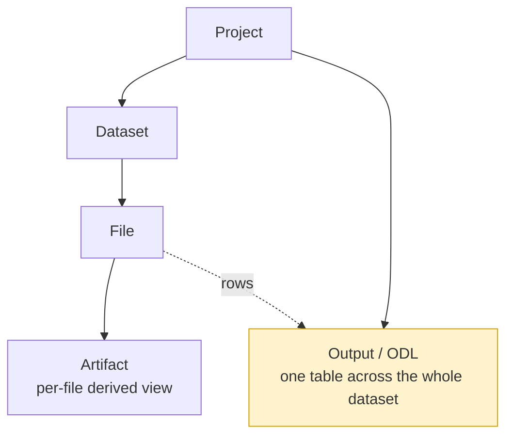
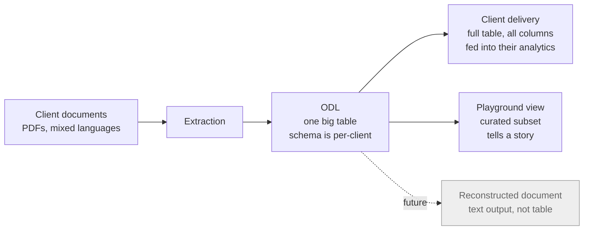
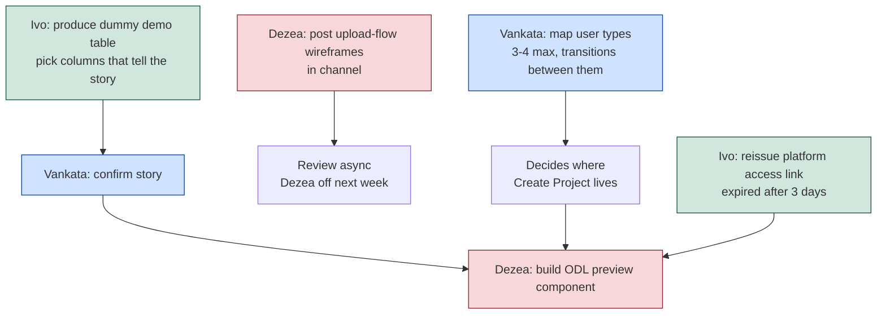

# Neuralith Playground / Projects — system hierarchy

Source: Playground Design Next Steps, 2026-07-23 (Ivo, Vankata, Dezea Studio).

## Project object hierarchy

Reading: a Project holds a Dataset of Files, each File yields an Artifact. The Output (ODL) hangs off the Project, not off any single File: it is one table for the whole dataset, where each File contributes one or more rows.

## Data model behind the ODL view

## What needs to happen

## Key constraints (from Vankata)

- Playground ODL view is a **showcase, not a tool**. No column manipulation, no expand/collapse. Wow moment on first screen.
- Client-facing ODL (Aumovio) is **not** the design ground truth. Playground needs something simpler.
- ODL schema is per-client. UI must be generic; Ivo picks which columns/values surface per dataset.
- ODL preview reuses the **same component** as the existing artifact preview, different artifact type.
- Project request is one-time in V1. Edit means propagating changes to Ivo mid-scoping — deferred.
- Playground → Create Project is gated on payment. Button may be hidden for unpaid users.

## Open questions

- Which user type lands where after registration? Real sales-pipeline clients go straight to Projects, demo users to Playground — but no map exists yet.
- Column clustering (Aumovio grouped view): Vankata says too complex for playground, relevant for real clients. Where does it land?
- Are the 5-8 pre-scoping questions written down anywhere, or does Ivo draft them?
- ArcelorMittal data is harder to make impressive at a glance. Is Aumovio the demo dataset?
